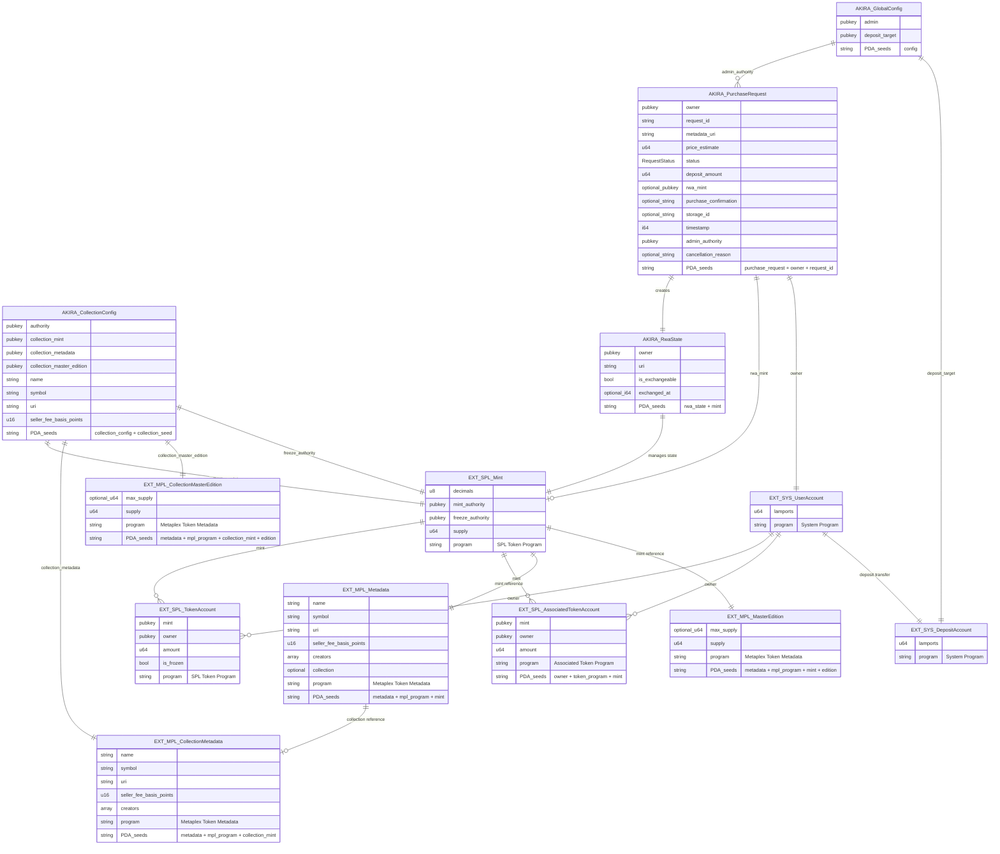

# Akira Solana RWA システム - アカウント関係図

## 外部プログラム含む完全なアカウントリレーション図



## プログラム別アカウント分類

### 🏠 Akira Program (Internal)

- `AKIRA_GlobalConfig`: グローバル設定
- `AKIRA_CollectionConfig`: コレクション設定
- `AKIRA_PurchaseRequest`: 購入リクエスト
- `AKIRA_RwaState`: RWA 状態管理

### 🪙 SPL Token Program (External)

- `EXT_SPL_Mint`: トークンミント
- `EXT_SPL_TokenAccount`: トークンアカウント
- `EXT_SPL_AssociatedTokenAccount`: 関連トークンアカウント

### 🎨 Metaplex Token Metadata Program (External)

- `EXT_MPL_Metadata`: NFT メタデータ
- `EXT_MPL_MasterEdition`: マスターエディション
- `EXT_MPL_CollectionMetadata`: コレクションメタデータ
- `EXT_MPL_CollectionMasterEdition`: コレクションマスターエディション

### 🔧 System Program (External)

- `EXT_SYS_UserAccount`: ユーザーアカウント（SOL 保持）
- `EXT_SYS_DepositAccount`: デポジットアカウント（SOL 受取）

## PDA シード情報

### Akira Program PDAs

```
GlobalConfig: ["config"]
CollectionConfig: ["collection_config", collection_seed]
PurchaseRequest: ["purchase_request", owner, request_id]
RwaState: ["rwa_state", mint]
```

### External Program PDAs

```
Metadata: ["metadata", mpl_token_metadata::ID, mint]
MasterEdition: ["metadata", mpl_token_metadata::ID, mint, "edition"]
AssociatedTokenAccount: [owner, spl_token::ID, mint]
```
